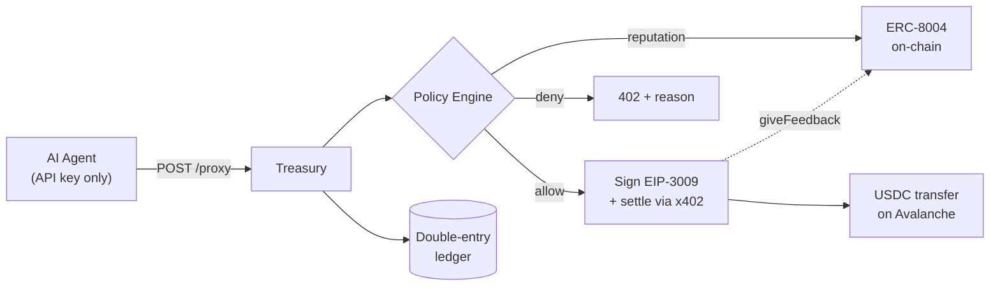

# Agent Treasury

> **The control plane for autonomous agent payments.** Agents get spending **authority, not private
> keys** — every payment routes through a policy engine (budgets, per-tx caps, velocity, merchant
> allowlist, on-chain reputation) before the treasury signs and settles real USDC on **Avalanche**.

Built for the **Speedrun: Agentic Payments** hackathon. Combines **x402** (HTTP-native stablecoin
payments) with **ERC-8004** (on-chain agent identity + reputation): an autonomous agent pays real
USDC, gated by on-chain reputation and a spend policy — **no human in the loop, and no way for the
agent to move value it shouldn't.**

### 🔴 Live deployment

The stack is deployed and running — explore it now:

- **Monitoring dashboard:** http://34.100.167.161:8090/
- **Admin panel** (configure agents): http://34.100.167.161:8090/admin.html

---

## The problem

The default x402 setup hands every agent a funded wallet and a private key. That's fine for a demo
and dangerous in production: a prompt-injected, buggy, or compromised agent can drain the wallet, pay
a malicious counterparty, or loop microtransactions until the balance is gone. There's no budget, no
allowlist, no notion of *who* is being paid.

**Agent Treasury is the missing governance layer.** Agents hold spending *authority scoped by
policy*, never raw keys. The treasury holds the keys, evaluates every payment against budget +
velocity + counterparty-reputation rules, signs only on approval, records everything in a
double-entry ledger, and writes feedback back to ERC-8004 to close the reputation loop.

## How it works



An agent never sees a private key — it authenticates with an API key and asks the treasury to pay.
The policy engine checks **merchant allowlist → on-chain reputation → per-tx cap → daily budget →
velocity**, deny-by-default and in order. Only on approval does the treasury wallet sign the
EIP-3009 authorization and settle through a self-hosted x402 facilitator. Every successful payment
also writes `giveFeedback` to ERC-8004, so a merchant's on-chain reputation is **earned by real
payment history**.

## What the demo shows

A research agent autonomously buys market data through the treasury. Watch four things happen with
no human in the loop:

| Beat | What happens | Why it matters |
|------|--------------|----------------|
| ✅ **Settle** | Pays good-data-co $0.10 → real USDC tx on Avalanche (Snowtrace link) | Agent moved value **without holding a key** |
| ⛔ **Reputation block** | Tries sketchy-data-inc → `402 REPUTATION_BELOW_THRESHOLD` | Treasury read on-chain rep (12 < 60) and **refused before signing** — no gas, no risk |
| ⛔ **Budget block** | Tries $0.60 → `402 PER_TX_CAP_EXCEEDED` | Even a trusted merchant **can't overspend** policy |
| 📈 **Reputation rises** | Successful payments raise good-data-co's ERC-8004 score (85 → 90) | Trust is **earned by transaction history** |

See [DEMO.md](./DEMO.md) for the full narrated script.

## Features

- **Policy engine** — merchant allowlist, per-tx cap, daily budget, velocity limit, and
  reputation-tiered limits. Pure, deny-by-default, fully unit-tested.
- **On-chain reputation gating** — reads ERC-8004 `getSummary` per counterparty (fail-closed, cached).
- **Real x402 settlement** — web3j EIP-3009 signing → x402.rs facilitator `/verify` + `/settle`.
  Gasless for the payer.
- **Reputation feedback loop** — writes `giveFeedback` on-chain after each settlement.
- **Double-entry ledger** + idempotent payment intents (safe retries, no double-spend).
- **Runtime admin** — create/configure agents and mint API keys from a web panel; no redeploy, no SQL.
- **Live dashboards** — budget burn-down + color-coded payment feed with Snowtrace links.
- **Scheduled reconciliation** — re-verifies settled intents against on-chain receipts.

## Tech stack

**Java 21 / Spring Boot 3** (virtual-threaded proxy) · **PostgreSQL** + Flyway · **web3j** (EIP-712 /
EIP-3009 signing) · **x402.rs** facilitator (Docker) · **ERC-8004** registries on **Avalanche Fuji** ·
Hardhat for contract deploy.

## Quick start

```bash
cp .env.example .env                 # fill throwaway testnet keys + addresses
./scripts/dev-db.sh up               # Postgres (+ treasury_test for tests)

# Run the app (offline/stub mode — no chain, no funds needed):
docker run -d --name treasury-app --network host --env-file .env \
  -v "$PWD/treasury":/app -w /app -v "$HOME/.m2":/root/.m2 \
  maven:3.9-eclipse-temurin-21 mvn -q spring-boot:run
# add -e X402_ENABLED=true -e ERC8004_ENABLED=true for real on-chain settlement
```

- **Monitoring dashboard:** `http://localhost:8090/`
- **Admin panel** (add/configure agents): `http://localhost:8090/admin.html`

Make a payment as an agent (no wallet, no key — just the API key). Point it at your local instance,
or at the **live deployment**:

```bash
# against the live deployment:
TREASURY_URL=http://34.100.167.161:8090 AGENT_KEY=demo-key-agent-1 python agent/buyer_agent.py
# or locally: TREASURY_URL=http://localhost:8090 ...
```

Full build/run/config and HTTP API reference: [docs/USAGE.md](./docs/USAGE.md). Deploy to a public
URL (GCP): [deploy/README.md](./deploy/README.md).

## Documentation

| Doc | What |
|-----|------|
| [DEMO.md](./DEMO.md) | Live demo script (the 4-beat narrative) |
| [DESIGN.md](./DESIGN.md) | Design rationale — problem, thesis, decisions |
| [docs/HLD.md](./docs/HLD.md) · [ARCHITECTURE.md](./docs/ARCHITECTURE.md) · [LLD.md](./docs/LLD.md) | Design at three altitudes |
| [docs/FLOWS.md](./docs/FLOWS.md) | Runtime sequences (payment, denial, reputation, reconciliation) |
| [docs/USAGE.md](./docs/USAGE.md) | Build/run/config, env reference, HTTP API |
| [docs/USER-GUIDE.md](./docs/USER-GUIDE.md) | For agent developers — how to pay, outcomes, limits |
| [deploy/README.md](./deploy/README.md) | Deploy the stack to a public URL (GCP) |

## Repository layout

```
.
├── treasury/              # Spring Boot app (Java 21): policy, ledger, intents, proxy, dashboards, admin
├── agent/                 # example autonomous buyer agents (scripted + LLM-driven)
├── contracts/erc8004/     # lean ERC-8004-compatible registries + Hardhat deploy/read scripts
├── infra/facilitator/     # x402.rs facilitator config for Fuji
├── smoke-test/            # Phase-0: web3j EIP-3009 signing → facilitator verify/settle
├── deploy/                # production docker-compose + GCP deploy guide
├── scripts/               # dev-db.sh, treasury-mvn.sh, smoke.sh, run-agent.sh
└── docs/                  # HLD, ARCHITECTURE, LLD, FLOWS, USAGE, USER-GUIDE
```

## Status

**Complete and demo-ready.** The full agentic-payments loop is verified end-to-end on Avalanche
Fuji: x402 USDC settlement gated by ERC-8004 reputation + spend policy, a feedback loop that raises a
merchant's on-chain reputation, live dashboards, an idempotent double-entry ledger, and scheduled
reconciliation. Both protocols are real and on-chain — no stubs in the demo path.
